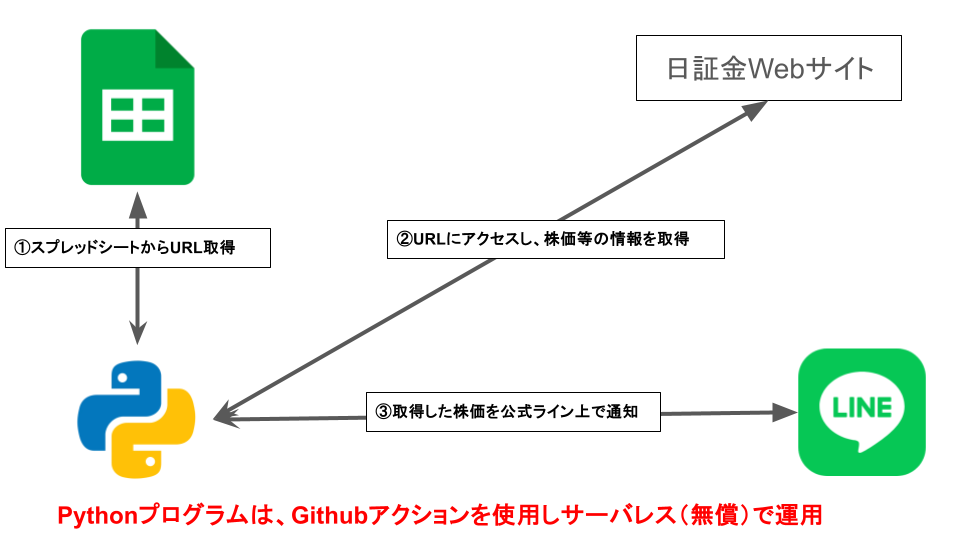
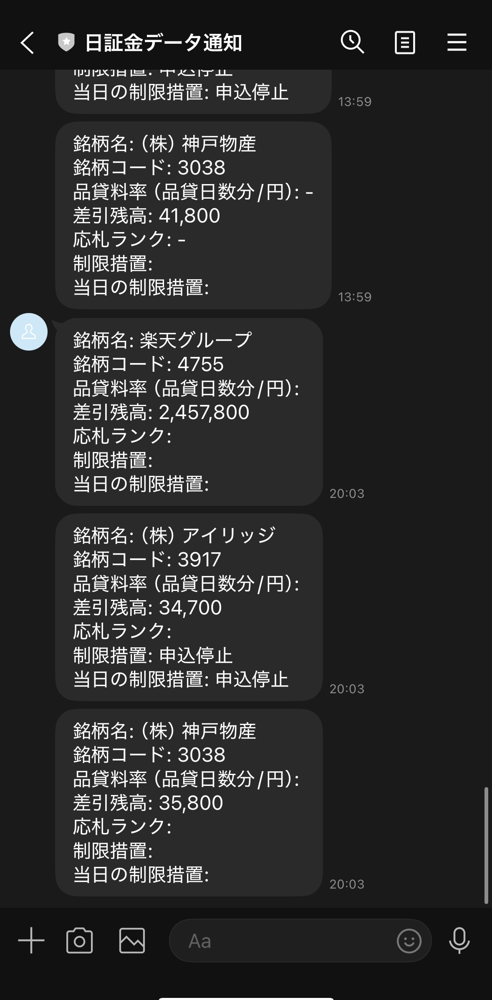

# 日証金データ LINE自動通知システム

### プロジェクト概要
投資家が毎日チェックする必要がある「日証金（日本証券金融）」の貸借取引データを、Googleスプレッドシートから動的に取得し、LINEへ自動通知するシステムです。

「毎日決まった時間にサイトを確認するのが手間」「外出先でもスマホでサクッと確認したい」という投資家の課題を、**運用コスト0円**のサーバーレス環境で解決しました。

### 実装した主要機能
- **動的な監視対象管理**: Google Sheets APIと連携。スプレッドシートにURLを貼るだけで、コードを触らずに通知対象を自由に変更可能。
- **高精度スクレイピング**: BeautifulSoup4を使用し、品貸料率、応札ランク、制限措置などの特定項目をピンポイントで抽出。
- **完全自動運用**: GitHub Actionsを活用し、毎日 12:30 / 19:30 のデータ更新タイミングに合わせた自動配信。
- **セキュアな設計**: LINEトークンやGoogle APIの鍵情報は `GitHub Secrets` で暗号化管理。

### 技術スタック
- **Language**: Python 3.9
- **Libraries**: BeautifulSoup4, gspread, line-bot-sdk, requests
- **Platform**: GitHub Actions (CI/CD / Scheduling)
- **External API**: Google Sheets API, LINE Messaging API

### こだわり・工夫した点
1. **運用コストの最適化**: 
   通常、定期実行にはVPS等の月額サーバー代がかかりますが、GitHub Actionsを採用することで**ランニングコスト完全無料**を実現しました。
2. **実行ラグの対策**: 
   GitHub Actionsの仕様による開始遅延（15分〜30分程度）を考慮し、実行予約時間を数分単位で調整（例：20分に設定）することで、目的の時刻に確実に情報が届くよう最適化しました。
3. **エラーハンドリング**: 
   サイト側のデータ更新が遅れている場合や、スプレッドシートの入力形式が正しくない場合でも、プログラムが異常終了しないよう例外処理を実装しています。

### システム構成

### 通知イメージ

